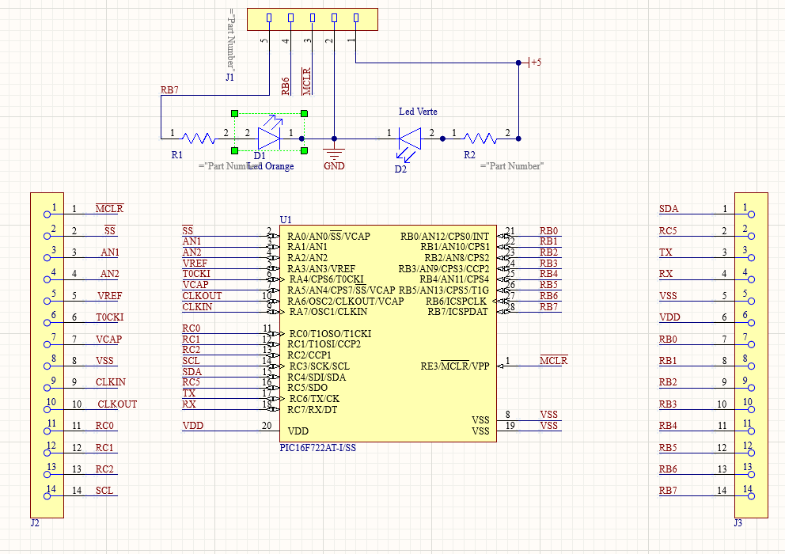

# Project PIC16F board 

This PCB is based on Microchip's PIC16F microcontroller. The PIC16F belongs to the PIC microcontroller family, renowned for its efficient RISC architecture and ease of programming.

Equipped with programmable flash memory, the PIC16F enables quick and easy firmware updates, simplifying the process of developing and maintaining electronic systems.
Its integrated EEPROM memory also offers non-volatile data storage, ensuring that crucial information is preserved even in the event of a power failure.
The PIC16F's numerous I/O pins facilitate interfacing with various external components, while its serial communication capabilities, such as I2C and UART, facilitate integration with other peripherals.
What's more, its interrupt management capabilities enable rapid response to real-time events, improving system responsiveness.

*Project duration: 2 days*

# Table of contents
- [Electronic diagram](#electronic-diagram)
- [PCB Design](#pcb-design)
  

## Electronic diagram

To program our pic16F22, we've added a 5-pin male connector that connects to the +5V, GND, RB6 and MCLR pins of the PIC16F microcontroller. This enables connection to the MPLAB kit and interfacing with the MLPAB ide developed by Microchip.

We've also added a green LED on the +5V to indicate that the board is powered up. We've also added an orange LED that flashes rapidly when the program is being transferred to the PIC16F.

Finally, we added two 14-pin female connectors to connect components to the PIC16F:

 

## PCB Design

The PCB has been realized on Altium Designer. It has a dimension of 6.5 cm and a height of 5 cm.  The board's top layer contains most of the components. 

Here's the top layer view of the PCB:

 

Here's the bottom layer view of the PCB:

 

Here is a 3d view of the PCB:

 

## Arduino Factory

 * [More details on this project](https://arduinofactory.fr/carte-pcb-atmega328p/)
  

